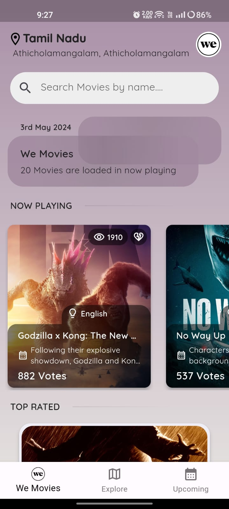
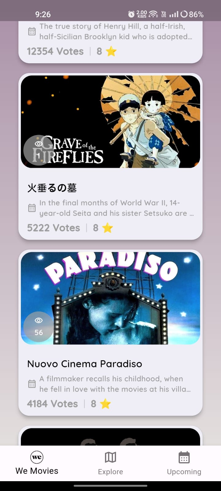
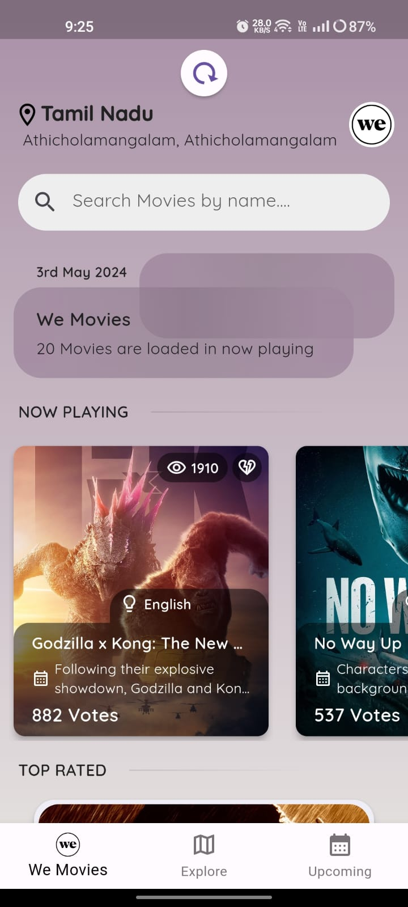
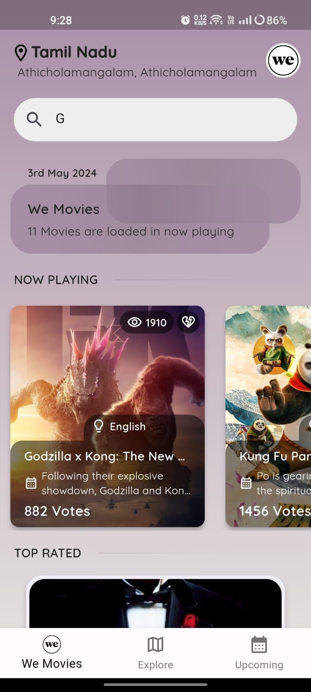
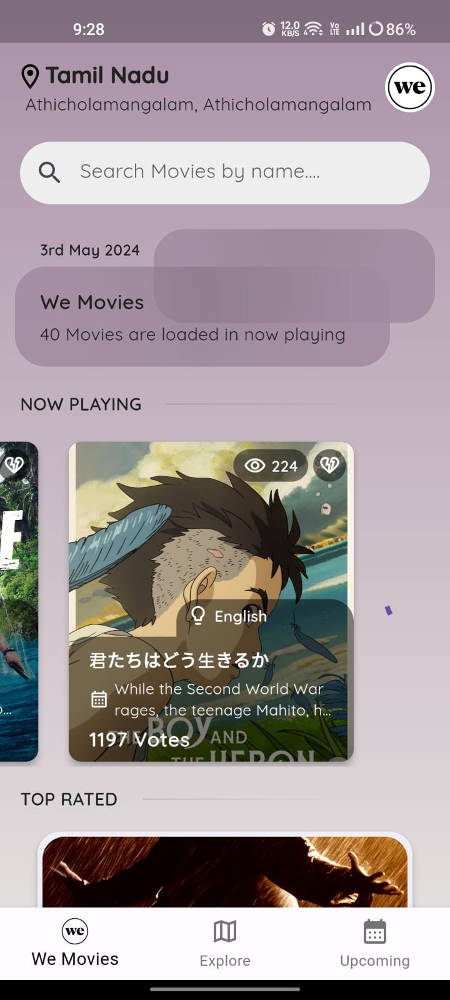

# ShowTime

<h3>
Seamlessly discover favorite movies with ease!
</h3>

A Flutter application for listing movies based on two categories(NowPlaying and TopRated) and providing local search functionality.
This app follows the BLoC (Business Logic Component) architecture and MVVM (Model-View-ViewModel) pattern for managing state and UI separation.

## Features

- Display movies from two categories: "Now Playing" and "Top Rated".
- Implement search functionality to filter movies by name.
- Efficient API caching for faster load times and reduced data usage.
- Scroll endlessly through the movie lists with smart pagination.
- Refresh movies list using simple pull down gesture.
- Utilize BLoC architecture for managing business logic and state.
- Follow MVVM pattern for clear separation of concerns.
- Fetch user location for enhanced performance and personalized content.

### Prerequisites

- Flutter SDK
- Dart SDK

## Getting Started

To run this application locally, follow these steps:

1. Make sure you have Flutter installed. For installation instructions, refer to the [Flutter documentation](https://flutter.dev/docs/get-started/install).
2. Clone this repository to your local machine.
3. Navigate to the project directory and run `flutter pub get` to install dependencies.
4. Connect a device or start an emulator.
5. Run the app using the command `flutter run`.

## Dependencies

This project uses several third-party dependencies. Some of the key dependencies include:

- `flutter_bloc`: Provides tools for implementing BLoC architecture in Flutter.
- `geolocator`: Allows fetching user location for personalized content.
- `geocoding`: Used for obtaining location details from latitude and longitude coordinates.
- `get_it`: Facilitates Dependency Injection.
- `http`: Used for making HTTP requests to fetch movie data.
- `cached_network_image`: Enables caching of movie poster images for improved performance.

For a full list of dependencies, refer to the `pubspec.yaml` file.

## Directory Structure
- lib/
- |-- config/                 # Configuration settings used across the application.
- |-- core/                   # Fundamental modules and utilities essential for functionality.
- |-- features/               # Individual features of the application, organized for modularization.
- |   |-- home/               # Landing and launch screens.
- |       |-- data/           # Data handling specific to the home feature.
- |       |-- domain/         # Business logic of the home feature.
- |       |-- presentation/   # UI and presentation logic of the home feature.

## License
Distributed under the MIT License. See LICENSE for more information.

## Contact

Twitter - https://x.com/iamSmkz
LinkedIn - https://www.linkedin.com/in/iamsmk

## Acknowledgements
Flutter
BLoC
MovieDB API

## Screenshots

| Landing Screen                               | Landing Screen 2                              | Pull To Refresh                              |
|----------------------------------------------|-----------------------------------------------|----------------------------------------------|
|  |  |  |

| Search                                | Pagination                                |
|---------------------------------------|-------------------------------------------|
|  |  |

## ScreenRecordings

| Video 1                                                                              | Video 2                                                                              | Video 3                                                                            |
|--------------------------------------------------------------------------------------|--------------------------------------------------------------------------------------|------------------------------------------------------------------------------------|
| (https://drive.google.com/file/d/1nf_AJAYf89qoj1PRtz6XMQOkouVGWwWB/view?usp=sharing) | (https://drive.google.com/file/d/1CgQ6LV9hKN1BxR8oFI7JJWQ68gFbpcjg/view?usp=sharing) | https://drive.google.com/file/d/1DxVcG9qR0rAPeRVjBsD9P_87ISSIjF2Y/view?usp=sharing |

Available in 'screenrecords' directory.

## APK
You can download the APK file by clicking the link below:

[Download APK](apk/ShowTime.apk)

Available in 'apk' directory.
